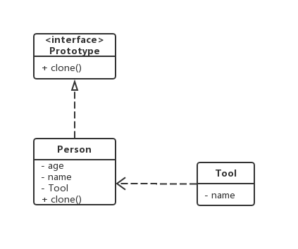

# Prototype(原型模式)

## 意图

用原型实例指定创建对象的种类，并且通过拷贝这些原型创建新的对象。

## 类图



## 浅克隆

创建一个新类，然后参数全部设置一遍。

因为是简单赋值，对象属性无法复制。

```
public class SimplePrototypeTest {

	@Test
	public void test() {
		Person man = new Person();
		man.setAge(18);
		man.setName("Lily");
		man.setTool(new Tool("hammer"));
		Person cloneMan = (Person) man.clone();

		assertNotSame(man, cloneMan);
		assertEquals(man.getAge(), cloneMan.getAge());
		assertEquals(man.getName(), cloneMan.getName());
		assertEquals(man.getTool(), cloneMan.getTool());
	}
}
```

可以看到，被克隆人和克隆人的锤子是同一个。

## 深克隆

利用类序列化输出输入克隆类，可以做到全克隆。

```
public class DeepPrototypeTest {

	@Test
	public void test() {
		Person man = new Person();
		man.setAge(18);
		man.setName("Lily");
		man.setTool(new Tool("hammer"));
		Person cloneMan = (Person) man.clone();

		assertNotSame(man, cloneMan);
		assertEquals(man.getAge(), cloneMan.getAge());
		assertEquals(man.getName(), cloneMan.getName());
		assertNotSame(man.getTool(), cloneMan.getTool());
	}
}
```

克隆人有自己的锤子了。