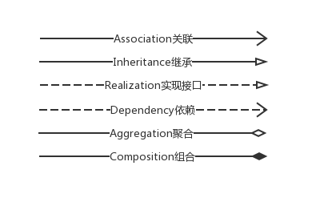

# Java-Design-Patterns
设计模式Java实现

## 目录

- [Creational(创建型)](https://github.com/xuyuji/Java-Design-Patterns/tree/master/Creational)

  创建型模式与对象的创建有关

- [Structural(结构型)](https://github.com/xuyuji/Java-Design-Patterns/tree/master/Structural)

  结构型模式处理类或对象的组合

- [Behavioral(行为型)](https://github.com/xuyuji/Java-Design-Patterns/tree/master/Behavioral)

  行为型模式对类或对象怎样交互和怎样分配职责进行描述

## 目标

1、用Java实现GoF中23种设计模式，给出对应的分析说明。

2、补充更多的设计模式

## 定义

### 类图关联线

## 参考资料

- [《设计模式》](https://book.douban.com/subject/1052241/)
- [java-design-patterns网站](https://java-design-patterns.com/)
- [wikipedia](https://en.wikipedia.org/wiki/Software_design_pattern)
- [维基百科](https://zh.wikipedia.org/wiki/%E8%AE%BE%E8%AE%A1%E6%A8%A1%E5%BC%8F_(%E8%AE%A1%E7%AE%97%E6%9C%BA))

